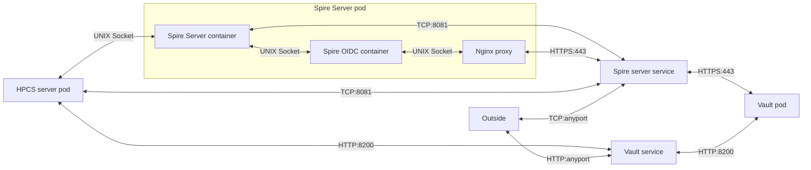

# HPCS High Performance Computing Secured

## Main goal

### Project

This partnership project involving CSC and Hewlett Packard Enterprise aims to enable HPC users to run secured jobs. It provides tools to enable anyone running secured jobs with encrypted data and specific confidential containers on a supercomputing site, leveraging (non exhaustively) :

- [SPIFFE/SPIRE](https://github.com/spiffe/spire)
- [Hashicorp Vault](https://github.com/hashicorp/vault)
- [Singularity / Apptainer encryption](https://github.com/apptainer/apptainer)
- [age encryption](https://github.com/FiloSottile/age)

### Architecture

In-depth architecture documentation is available [here](/docs/architecture/architecture.md)

## Demonstration

[](https://asciinema.org/a/PWDzxlaVQmfGjbh30KKNTRO1f)

## Quickstart

### Client

Assuming that the HPCS server is setup. (See [Server](#Server)).

To start using HPCS Client, the supported method has two requirements, docker and docker-compose.

#### Pulling images

Start by pulling the three images.

```bash
docker pull ghcr.io/cscfi/hpcs/[container/data/job]-prep:['branch-name'/latest]
```

```bash
docker pull ghcr.io/cscfi/hpcs/container-prep:latest
docker pull ghcr.io/cscfi/hpcs/data-prep:latest
docker pull ghcr.io/cscfi/hpcs/job-prep:latest
```

#### Configuring the client

Information about the Spire-Server, the HPCS-Server and the Vault depends on the respective server installation setup choices. For more information on the configuration, please contact your HPCS-Server service provider.

The client configuration is made of 4 main sections, in INI format. In depth description of the configuration files is available [here](/docs/configuration).

Example of client configuration :

```ini
[spire-server]
address = spire.lumi.csc.fi
port = port
trust-domain = spire-trust-domain

[hpcs-server]
url = https://hpcs-server:port

[vault]
url = https://vault-provider:port

[supercomputer]
address = lumi.csc.fi
username = etellier
```
Please replace the `spire-server` section configuration with the settings relative to your Spire Server.
You will also need to replace `hpcs-server` with the address of your HPCS server, eventually the `port` with the port on which the HPCS server is exposed.
The `vault` is the same as the `hpcs-server` section, please complete it with your vault settings.
Finally, configure the supercomputer to use in the `supercomputer` section, specifying it's address under `address` and your `username` on the system. Your SSH Key needs to be setup.

#### Prepare the runtime

We recommend using docker-compose to run the process. Here is an example of a docker-compose file :
It's composed of 3 sections, covering the three main steps of the process.
- Prepare, encrypt and ship the `talinx/jp2a` image for the user `etellier` on node `nid003044`
- Prepare, encrypt and ship the input data under `./workdir/jp2a_input` for the user `etellier` on node `nid003044`
- Run the `jp2a` preapred image on the supercomputer `nid003044` node, specifying application args `/sd-container/encrypted/jp2a_input/image.png --width=100 --output=/sd-container/output/result` (the `jp2a_input` prepared dataset will be available under `/sd-container/encrypted/jp2a_input` at runtime). You also can specify your verifications scripts to run before and after the application here : `[-i/-o] /pfs/lustrep4/scratch/project_462000031/etellier/verification_scripts`

In depth documentation of the cli of the 3 parts are available [here](/docs/cli).

```yaml
version: '2.4'

services:
  container-prep:
    image: ghcr.io/cscfi/hpcs/container-prep:latest
    command:
      - "--config"
      - "/tmp/hpcs-client.conf"
      - "-b"
      - "talinx/jp2a"
      - "-s"
      - "/Users/telliere/secure_job/workdir"
      - "-e"
      - "-u"
      - "etellier"
      - "-c"
      - "nid003044"
      - "--data-path"
      - "/tmp/encrypted_prepared_jp2a.sif"
      - "--data-path-at-rest"
      - "/scratch/project_462000031/etellier/"
      - "--username"
      - "etellier"
    volumes:
      - /etc/group:/etc/group
      - /etc/passwd:/etc/passwd
      - /var/run/docker.sock:/var/run/docker.sock
      - $PWD/workdir:/tmp
      - $HOME/.ssh:/tmp/.ssh
    environment:
      - PWD=${PWD}
      - HOME=${HOME}
    user: "1001" # On Linux : Your uid (gathered using `id`). Remove on MacOS
    group_add:
     -  "120"    # The docker daemon group. Remove on MacOS


  data-prep:
    image: ghcr.io/cscfi/hpcs/data-prep:latest
    command:
      - "--config"
      - "/tmp/hpcs-client.conf"
      - "-i"
      - "/tmp/jp2a_input"
      - "-o"
      - "/tmp/"
      - "-u"
      - "etellier"
      - "-c"
      - "nid003044"
      - "--data-path"
      - "/tmp/encrypted_jp2a_input.tgz"
      - "--data-path-at-rest"
      - "/scratch/project_462000031/etellier/"
      - "--username"
      - "etellier"
    volumes:
      - /var/run/docker.sock:/var/run/docker.sock
      - $PWD/workdir:/tmp
      - $HOME/.ssh:/tmp/.ssh
    environment:
      - PWD=${PWD}
      - HOME=${HOME}

  job-prep:
    image: ghcr.io/cscfi/hpcs/job-prep:latest
    command:
      - "--config"
      - "/tmp/hpcs-client.conf"
      - "-N"
      - "1"
      - "-p"
      - "standard"
      - "-t"
      - "\"00:60:00\""
      - "-A"
      - "project_462000031"
      - "--nodelist"
      - "nid003044"
      - "--workdir"
      - "/scratch/project_462000031/etellier"
      - "-ai"
      - "/scratch/project_462000031/etellier/encrypted_prepared_jp2a.sif.info.yaml"
      - "-di"
      - "/scratch/project_462000031/etellier/encrypted_jp2a_input.tgz.info.yaml"
      - "-args"
      - "\"\\\" /sd-container/encrypted/jp2a_input/image.png --width=100 --output=/sd-container/output/result \\\"\""
      - "-i"
      - "/pfs/lustrep4/scratch/project_462000031/etellier/verification_scripts"
      - "-o"
      - "/pfs/lustrep4/scratch/project_462000031/etellier/verification_scripts"
      - "-flags"
      - "--env TERM=xterm-256color"
      - "-f"
    volumes:
      - $PWD/workdir:/tmp
      - $HOME/.ssh:/tmp/.ssh
    environment:
      - PWD=${PWD}
      - HOME=${HOME}
```

#### Run the preparations and the job

To run one of the containers :

```bash
docker compose run --rm [data/container/job]-prep
```

If you want to run the whole process by yourself : 

```bash
docker compose run --rm data-prep
docker compose run --rm container-prep
docker compose run --rm job-prep
```

An example demonstration is available [here](https://asciinema.org/a/PWDzxlaVQmfGjbh30KKNTRO1f).

### Server

HPCS Server is an API, interfacing HPCS client with Vault and Spire. This section needs basic knowledge of [SPIFFE/SPIRE](https://spiffe.io/) and [HashiCorp Vault](https://www.vaultproject.io/). 

For k8s, we only consider `kubectl` and `ansible` as available tools and that `kubectl` can create pods. Vault roles, spire identities are created automatically.

For docker-compose, we consider the Vault and the Spire Server as setup and the Spire-OIDC provider implemented to allow login to the vault using SVID identity. We also consider that proper roles are created in Vault to authorize HPCS Server to write roles and policies to the Vault, using a server SPIFFEID.

#### K8s

HPCS' serverside consists in an web API. The difficulty in the installation of it comes with the underlying services that needs to be available for it to run properly. Here is a scheme of the architecture of a fully-installed HPCS server side.


(Ports are specified for the serverside, clients ports used for communication doesn't matter)

This architecture comes in 3 different main parts :
- HPCS Server (1 Container, containing Spire-Agent and HPCS Server)
- Spire Server (3 Containers, spire-server, spire-oidc, and hpcs-nginx)
- Vault (Helm chart, not managed by HPCS)

In order to proceed to the deployment of this architecture, k8s is the supported method, all the code associated is available under `/k8s`.

##### Pre-requisite

Before proceeding to HPCS' deployment, an original setup is required including :
- A ready-to-run k8s cluster
- `kubectl` and `helm` available and able to run kubernetes configurations (`.yaml`)
- `rbac`, `storage` and `dns` and `helm` kubernetes capabilities, f.e : `microk8s enable rbac storage dns helm` with microk8s.
  
Please note down the name of your k8s cluster in order to run later deployments.

##### Configuration

Several configurations are to be reviewed before proceeding.
- Nginx SSL Certificate path : Please review in `/k8s/spire-server-nginx-configmap.yaml` (section `ssl_certificate`) and `/k8s/spire-server-statefulset.yaml` (section `volumeMounts` of container `hpcs-nginx` and section `volumes` of the pod configuration). If you plan to run the deployment using ansible, please review `/k8s/deploy-all.yaml`, section `Copy oidc cert to vault's pod` and `Create spire-oidc {key, csr, cert}` for the host path to the certificate. Create the directory configured before running deployment.
  
- Cluster name : Please review in `/k8s/hpcs-server-configmap.yaml`, section "`agent.conf`", then "`k8s_psat`" and `/k8s/spire-server-configmap.yaml`, section "`server.conf`", then "`k8s_psat`", replace "`docker-desktop`" with your k8s cluster name.
  
- For further information about spire agent/ server configurations under `/k8s/hpcs-server-configmap.yaml` and `/k8s/spire-server-configmap.yaml`, please refer to spire-server [configuration reference](https://spiffe.io/docs/latest/deploying/spire_server) and spire-agent [configuration reference](https://spiffe.io/docs/latest/deploying/spire_agent/). 


##### Bash

This part of the documentation walks you through the different steps necessary in order to run a manual deployment of HPCS' serverside (including Vault, Spire-Server and HPCS Server).

__Starting with the "`spire-server`" pods :__

Generate your nginx certificate :
```bash
openssl req -x509 -nodes -days 365 -newkey rsa:2048 -keyout /path/to/your/privatekey.key -out /path/to/your/certificate.crt -addext "subjectAltName = DNS:spire-oidc"
```

Create HPCS namespace :
```bash
cd k8s
kubectl apply -f hpcs-namespace.yaml 
```

Create Spire service account and cluster role :
```bash
kubectl apply -f spire-server-account.yaml -f spire-server-cluster-role.yaml
```

Create configmaps for spire-server, spire-oidc and nginx proxy :
```bash
kubectl apply -f spire-oidc-configmap.yaml -f spire-server-configmap.yaml -f spire-server-nginx-configmap.yaml 
```

Create spire-server statefulset, managing spire-server-x pods :
```bash
kubectl apply -f spire-server-statefulset.yaml
```

Expose spire-oidc proxy and spire-server's api over the cluster :
```bash
kubectl apply -f spire-server-service.yaml -f spire-oidc-service.yaml
```

At this point, you should be able to see at least one `spire-server-x` pod, f.e :

```bash
kubectl get -n hpcs pod/spire-server-0
NAME             READY   STATUS    RESTARTS      AGE
spire-server-0   3/3     Running   0             30s
```

And the port on which the spire-server API is exposed (here 31140) :
```bash
kubectl get -n hpcs service/spire-server  
NAME           TYPE           CLUSTER-IP      EXTERNAL-IP   PORT(S)          AGE
spire-server   LoadBalancer   10.99.214.248   localhost     8081:31140/TCP   30s
```

__Then install Hashicorp Vault via it's official helm chart (here with microk8s):__

Add hashicorp repo and run installation :
```bash
microk8s helm3 repo add hashicorp https://helm.releases.hashicorp.com
helm install vault hashicorp/vault --version 0.27.0 --namespace=hpcs
```

Initialize the Vault :
```bash
kubectl exec -it vault-0 -n hpcs -- vault operator init -n 1 -t 1
```
Note unseal token and root token.

Unseal vault :
```bash
kubectl exec -it vault-0 -n hpcs -- vault operator unseal [seal token]
```

Connect to the vault to enable jwt auth and kvv2 secrets, register oidc as a source :
```bash
kubectl exec -it vault-0 -n hpcs -- sh
export VAULT_TOKEN="[root token]"

# Enable kvv2
vault secrets enable -version=2 kv

# Enable jwt auth
vault auth enable jwt

# Connect OIDC authority (spire-oidc)
vault write auth/jwt/config oidc_discovery_url=https://spire-oidc oidc_discovery_ca_pem="
-----BEGIN CERTIFICATE-----
...
-----END CERTIFICATE-----
"
```

Expose Vault's API to the node :
```bash
kubectl expose service vault --name="vault-external" --type="NodePort" --target-port 8200 -n hpcs
```

At this point, Vault is running and it's API is exposed, to check on which port, run :
```bash           
NAME             TYPE       CLUSTER-IP       EXTERNAL-IP   PORT(S)                         AGE
vault-external   NodePort   10.111.198.147   localhost        8200:31819/TCP,8201:31587/TCP   2s
```

__Next step is to create a spire identity and it's vault role in order to be able to identify HPCS-Server against Vault__

Get your kubernetes node uid (repeat this and the following spire identity creation for every nodes):
```bash
kubectl get nodes -o json | grep uid
```

Check wether you run containers using cgroupsv2 :
```bash
grep cgroup2 /proc/filesystems
```

Create the spire identity (If not using cgroupsv2):
```bash
kubectl exec -n hpcs spire-server-0 -c spire-server -- ./bin/spire-server entry create -spiffeID spiffe://hpcs/hpcs-server/workload -parentID spiffe://hpcs/spire/agent/k8s_psat/[Cluster Name]/[UID] -selector k8s:pod-name:hpcs-server
```

Create the spire identity (If using cgroupsv2):
```bash
kubectl exec -n hpcs spire-server-0 -c spire-server -- ./bin/spire-server entry create -spiffeID spiffe://hpcs/hpcs-server/workload -parentID spiffe://hpcs/spire/agent/k8s_psat/[Cluster Name]/[UID] -selector unix:uid:0
```

Connect to vault and create hpcs-server policy :
```bash
> kubectl exec -it vault-0 -n hpcs -- sh
/ $ vi /tmp/policy
path "auth/jwt/role/*" {
  capabilities = ["sudo","read","create","delete","update"]
}
path "sys/policies/acl/*" {
  capabilities = ["sudo","read","create","delete","update"]
}
/ $ vault policy write hpcs-server /tmp/policy
/ $ vault write auth/jwt/role/hpcs-server role_type=jwt user_claim=sub bound_audiences=TESTING bound_subject=spiffe://hpcs/hpcs-server/workload token_ttl=24h tok
en_policies=hpcs-server
```

__You can now deploy HPCS server__

Create hpcs-server and hpcs-spire service accounts :
```bash
kubectl apply -f hpcs-server-account.yaml -f hpcs-spire-account.yaml 
```

Create hpcs server configmap :
```bash
kubectl apply -f hpcs-server-configmap.yaml
```

Create hpcs-server statefulset (and underlying pods) :
```bash
kubectl apply -f hpcs-server-statefulset.yaml
```

Expose hpcs-server api over the cluster :
```bash
kubectl apply -f hpcs-server-service.yaml
```

Expose hpcs-server service over the node :
```bash
kubectl expose service hpcs-server --name="hpcs-server-external" --type="NodePort" --target-port 10080 -n hpcs
```

Check exposed port :
```bash           
NAME             TYPE       CLUSTER-IP       EXTERNAL-IP   PORT(S)                         AGE
hpcs-server-external   NodePort   10.111.198.151   localhost        10080:31827/TCP   2s
```

That's it, you can now use HPCS server as you please.

##### Ansible

:warning: This method is currently still under development. You could run into non-documented issues.

The previously explained steps can be automatically run using an ansible playbook available under `/k8s/deploy-all.yaml`

All the pre-requisites listed before are necessary to run this playbook. If you are running kubernetes using `microk8s`, you will need to create aliases or fake commands for `helm`, for example using a script :
```bash
#!/bin/bash

microk8s helm3 $@
```
Written as `/usr/bin/helm`.

You will also need ansible k8s and openssl plugins :
```bash
ansible-galaxy collection install kubernetes.core
ansible-galaxy collection install community.crypto
```

You can now run the ansible playbook :
```bash
cd k8s
ansible-playbook deploy-all.yaml
```

#### Docker-compose

:warning: This method is not the officially supported method for HPCS Server and merely intended for testing purposes.

Pull server's image using Docker pull :

```bash
docker pull ghcr.io/cscfi/hpcs/server:latest
```

The server configuration is made of 2 main sections, in INI format. In depth description of the configuration files is available [here](/docs/configuration).

You'll be able to configure your Spire Server interfacing specifying :
- Address and port of the spire-server API.
- Spire trust domain.
- pre-command and spire-server-bin : e.g pre-command = "`kubectl exec -n spire spire-server-0 -- `" and spire-server-bin = "`spire-server`" will then be used to create cli interactions with the Spire Server socket (i.e : `kubectl exec -n spire spire-server-0 -- spire-server entry show`). Please keep this part as-it-is when running docker standalone and mount the spire-server directory at it's default path (`/tmp/spire-server`).

Vault configuration will work the same as for the client (using a base `url` config). The main difference is that you need to specify the name of the spire-server role in the Vault. This role needs to be created manually and needs to be bound to a policy allowing it to create policies and roles for clients (data/container preparation) and workloads (accessing data/container).

```ini
[spire-server]
address = "spire.lumi.csc.fi"
port = PORT
trust-domain = TRUST_DOMAIN
pre-command = ""
spire-server-bin = spire-server

[vault]
url = https://vault-provider:port
server-role = hpcs-server
```

The server image comes with a non-configured agent, it's configuration is assumed to be mounted under `/tmp/spire-agent.conf`. Several [node attestation methods](https://github.com/spiffe/spire/tree/main/doc) (see `plugin_agent_nodeattestor`) are available, the goal is to register the HPCS server Spire agent under a specific identity to provide workload identities for the server (then used to write policies and roles in vault).

An example configuration, using `join_token` attestation method :

```hcl
agent {
    data_dir = "./data/agent"
    log_level = "DEBUG"
    trust_domain = "TRUST_DOMAIN"
    server_address = ""
    server_port = PORT
    socket_path = "/tmp/spire-agent/public/api.sock"
    join_token = "TOKEN"
    insecure_bootstrap = true
}

plugins {
   KeyManager "disk" {
        plugin_data {
            directory = "./data/agent"
        }
    }

    NodeAttestor "join_token" {
        plugin_data {}
    }

    WorkloadAttestor "unix" {
        plugin_data {
            discover_workload_path = true
        }
    }
}
```


To run the server as a standalone Docker, we recommend using docker-compose.

An in depth documentation of the server's cli is available [here](/docs/configuration).

This docker-compose file specifies the proper spire-agent configuration to use, the mountpoint of the spire-server directory and the path to the mounted hpcs configuration.

```yaml
version: '2.4'

services:
  server:
    image: ghcr.io/cscfi/hpcs/server:dockerfile_everywhere
    command:
      - "--config"
      - "/tmp/hpcs-server.conf"
    ports:
      - 10080:10080
    volumes:
      - $PWD:/tmp
      - $PWD/spire-agent.conf:/tmp/agent.conf
      - /tmp/spire-server:/tmp/spire-server
    environment:
      - PWD=${PWD}
```

You can then run it using :
```bash
docker-compose run server
```

## Limitations

This project has been developed to work on LUMI and is currently (03/2024) still under development. The goal was to use LUMI as-is, without the need for changes by administrators. Even though this makes it easier to adapt to other environments, it also means introducing limitations that can prevent HPCS to achieve its full potential. These limitations are discussed below.

### Node attestation

This project enables users to chose who can read their data or containers based on UNIX identities on the super-computer platform. Another important feature is the possibility for them to limit this access to a specific set of nodes on the supercomputer site. However, this feature requires the attestation of the nodes.

[Several methods of attestation](https://github.com/spiffe/spire/tree/main/doc) exist using Spire. The following are most relevant for HPCS:
- Token based attestation (user provides a token that is pre-registered to attest the node using it).
- Slurm based attestation (not in use at the moment, needs first to make sure that slurm is a trustable source of information to attest the node).
- TPM based attestation ([with DevID](https://github.com/spiffe/spire/blob/main/doc/plugin_agent_nodeattestor_tpm_devid.md) or [without](https://github.com/boxboat/spire-tpm-plugin)).
- Other hardware based key management based attestation (ex : [sev-snp](https://github.com/ufcg-lsd/spire-amd-sev-snp-node-attestor), in the future).

Using TPM, for example, it is very easy to run automatic node attestation, based on hardware managed keys that can't be easily spoofed. Unfortunately, LUMI does not provide TPM at the moment and for this reason, node attestation is currently made using a dummy endpoint providing join tokens to anyone. However, this behaviour could easily be modified to strengthen the node attestation with very low code modification for other supercomputers. For example, the node attestation could be performed by admins instead of the present user-initiated attestation.

### Encrypted container

The goal of this project was to leverage Singularity/Apptainer's [encrypted containers](https://docs.sylabs.io/guides/3.4/user-guide/encryption.html). This feature enables the end user to protect the runtime of the container, allowing it to confine unencrypted data within the encrypted container, adding an extra layer of security. 

Unfortunately for LUMI, this feature relies on different technologies, depending the permission level at which the container is encrypted, this behaviour is documented in the following table for usage on LUMI :

| Build \ Run | root ? | singularity-ce version 3.11.4-1 (LUMI) | apptainer version 1.2.5 (Binary able to be shipped to LUMI) |
| --- | --- | --- | --- |
| singularity-ce version 3.11.4 | yes | Unable to decrypt filesystem (no dm_crypt) | Failure (says user namespaces are needed) |
| singularity-ce version 3.11.4 | no | doesn’t build | doesn’t build |
| apptainer version 1.2.5 | yes | Unable to decrypt filesystem (no dm_crypt) | Failure (says user namespaces are needed) |
| apptainer version 1.2.5 | no | Filesystem not recognized | Failure (says user namespaces are needed) |

Two main reasons for the issues with the encrypted containers :
- Cannot run as root on a node (no workaround, as this is a feature of HPC environments).
- User namespaces are disabled on LUMI (for secure reason, [this stackexchange](https://security.stackexchange.com/questions/267628/user-namespaces-do-they-increase-security-or-introduce-new-attack-surface) has some explanations).
  
To run encrypted containers as described above, we would need to enable user namespaces on the platform. This would require a thorough risk/benefit assessment, since it introduces new attack surfaces and therefore will not be introduced lightly, at least not on on LUMI in the near future.

We mitigate the unavailability of encrypted containers in two steps :
- Encryption of the container at rest (encryption of the image file while stored on the supercomputer, decryption right before runtime)
- Usage of encrypted FUSE Filesystems in the container. This is achieved using `gocryptfs` (actually the same way as Singularity does it for encrypted containers) but only for some mountpoints. This for example allows us to certify that the input dataset won't ever be written as plaintext on the node as well as the output data.

However, this limitation has known solutions (cf. user namespaces) that will be leveraged or not on the platforms. The code was originally written to work with encrypted containers and this code is currently commented out but still available in case of usage on platform supporting user namespaces. Another lead that hasn't been explored as of today is [the newest version of Apptainer](https://github.com/apptainer/apptainer/releases/tag/v1.3.0), introducing new behaviour based on setuid.

### Client attestation

When a client wants to encrypt its data or container and to give access to it to someone, it's automatically attested, based on it's public IP. A workload identity is then automatically created, based on the `sha256sum` of the binary calling the workload API or the image_id of the container where the workload is running (See #5). This behaviour represents a problem because this attestation method isn't applicable to every client:
- Client runs containers using cgroupsv1
  - Fine, the docker image_id can be used. However, this image_id can be spoofed
- Client runs containers using cgroupsv2
  - Client runs on Linux
    - `spire-agent api fetch` can be attested using spire-agent binary's `sha256sum`
    - `python3 ./utils/spawn_agent.py` can't be attested since the `sha256sum` recognised by the workload API is `python3`'s. A mitigation to that would be to compile the code, if possible. This would potentially provide a unique binary that would then be able to be attested using `sha256sum` 
  - Client runs on MacOS
    - No attestation is doable at the moment since MacOS doesn't support docker and runs container inside of a Linux VM
      - Using cgroupsv2
      - Replacing every calling binary by the hypervisor

Since this limitation doesn't represent a confidentiality issue (a client isn't ever provided more than a write-only permission), current mitigations are more practical than secure (again, see #5).
