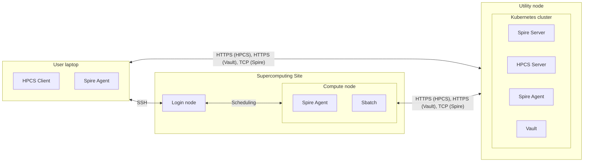
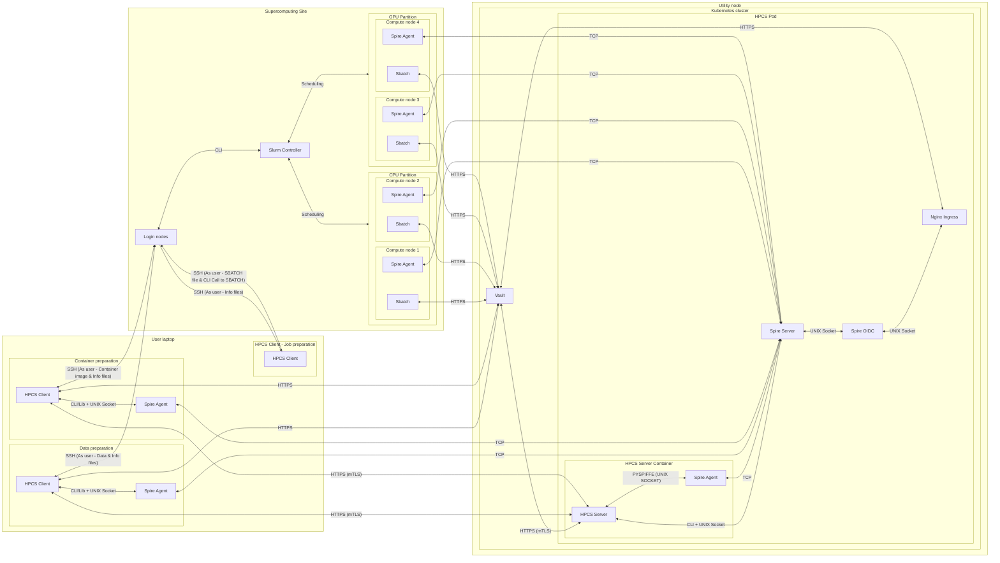

# Architecture

## Current architecture - Overview

## Current architecture - In depth

This diagram doesn't show the HTTPS requests from client/compute node to HPCS Server used to register the agents since this behaviour is a practical workaround. See section "Limitations" in [HPCS/README.md](https://github.com/CSCfi/HPCS/blob/main/README.md#limitations) for more information.