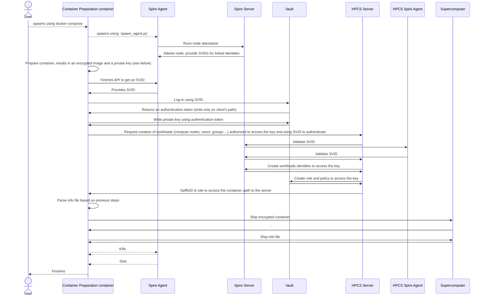
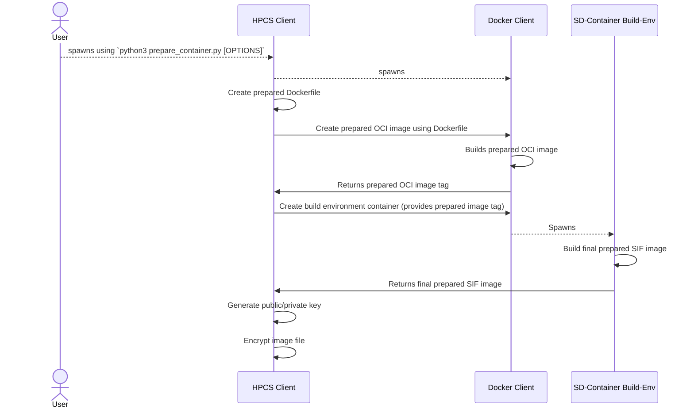
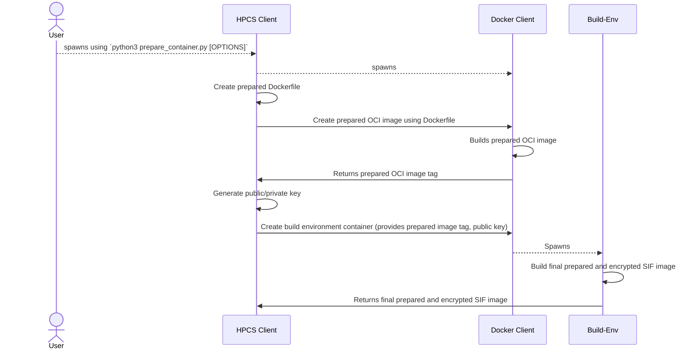

# Container preparation

This step consist in using an original OCI image to prepare it, encrypt it and ship it to the supercomputing site, it's decryption key to the vault.

## Sequence diagram of this step

## Sequence diagram of the container's preparation (without shipping)

### Image is prepared and then encrypted (Encryption at rest)

This step is currently (3/2024) used to encrypt the container. It does not require changes on LUMI to work.

### Image is prepared and SIF encrypted

When HPC nodes support encrypted containers, this process can be used.

