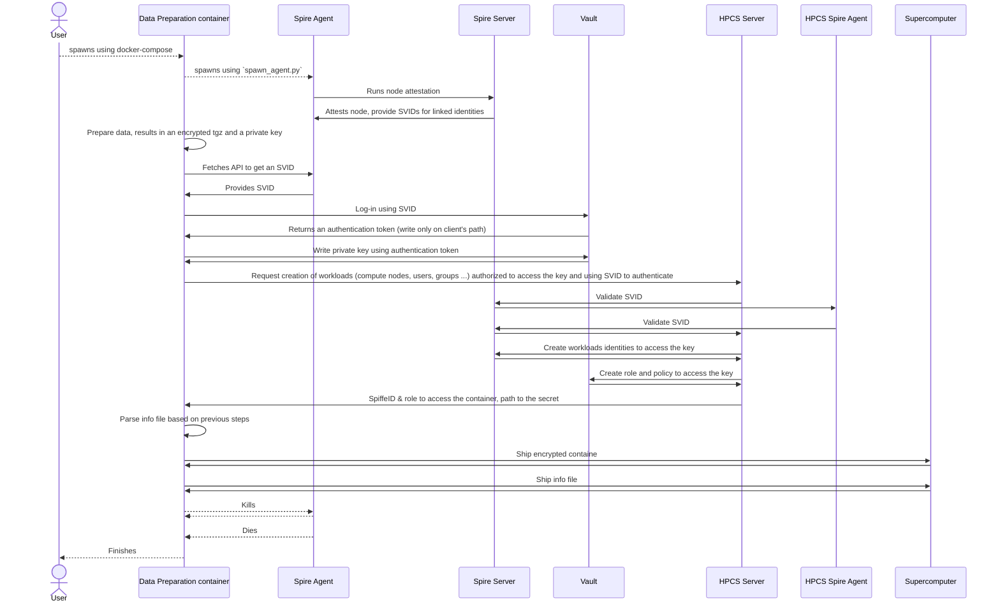

# Data preparation

This step consists in using an input directory, encrypt it and ship it to the supercomputing site, it's decryption key to the vault.

## Sequence diagram of data preparation

```mermaid
sequenceDiagram
    actor User
    User -->> Data Preparation container: spawns using docker-compose
    Data Preparation container -->> Spire Agent: spawns using `spawn_agent.py`
    Spire Agent ->> Spire Server: Runs node attestation
    Spire Server ->> Spire Agent: Attests node, provide SVIDs for linked identities
    Data Preparation container ->> Data Preparation container: Prepare data, results in an encrypted tgz and a private key
    Data Preparation container ->> Spire Agent: Fetches API to get an SVID
    Spire Agent ->> Data Preparation container: Provides SVID
    Data Preparation container ->> Vault: Log-in using SVID
    Vault ->> Data Preparation container: Returns an authentication token (write only on client's path)
    Data Preparation container ->> Vault: Write private key using authentication token
    Vault ->> Data Preparation container: 
    Data Preparation container ->> HPCS Server: Request creation of workloads (compute nodes, users, groups ...) authorized to access the key and using SVID to authenticate
    HPCS Server ->> Spire Server: Validate SVID
    Spire Server ->> HPCS Spire Agent: 
    HPCS Spire Agent ->> Spire Server: Validate SVID
    Spire Server ->> HPCS Server: 
    HPCS Server ->> Spire Server: Create workloads identities to access the key
    Spire Server ->> HPCS Server: 
    HPCS Server ->> Vault: Create role and policy to access the key
    Vault ->> HPCS Server: 
    HPCS Server ->> Data Preparation container: SpiffeID & role to access the container, path to the secret
    Data Preparation container ->> Data Preparation container: Parse info file based on previous steps
    Data Preparation container ->> Supercomputer: Ship encrypted containe
    Supercomputer ->> Data Preparation container: 
    Data Preparation container ->> Supercomputer: Ship info file
    Supercomputer ->> Data Preparation container: 
    Data Preparation container -->> Spire Agent: Kills
    Spire Agent -->> Data Preparation container: 
    Spire Agent -->> Data Preparation container: Dies
    Data Preparation container -->> User: Finishes
```
