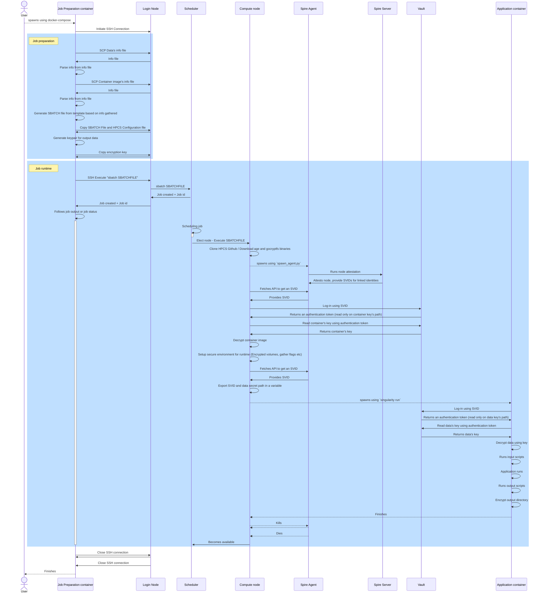

# Job preparation

This step consists in the preparation of the secure job, followed by its execution. It requires two info files (one for the data, one for the secured container) and more settings about the runtime (arguments, parameters for the singularity container ...).

## Sequence diagram of this step

